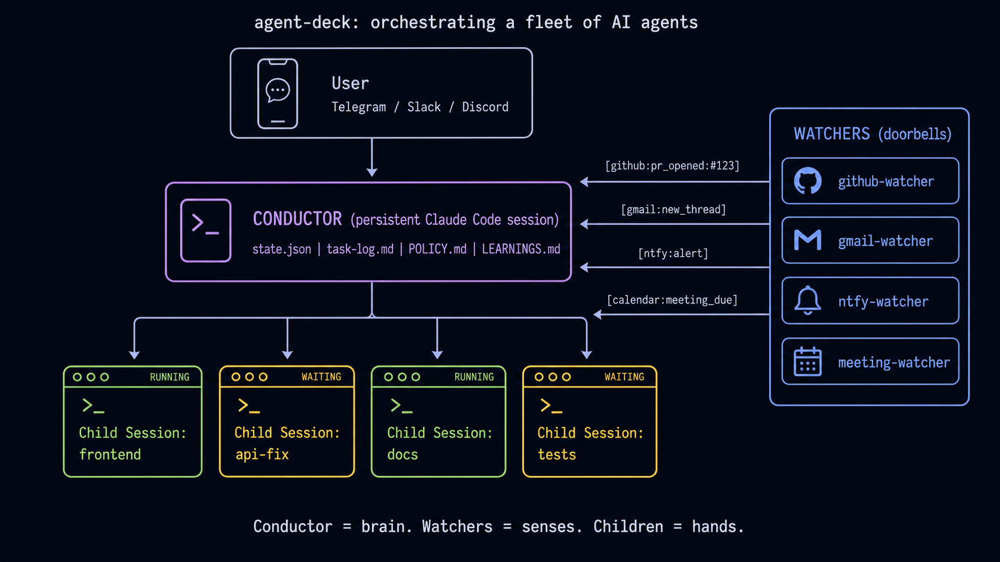

<div align="center">

<!-- Status Grid Logo -->


# Agent Deck

**Your AI agent command center**

[](https://github.com/asheshgoplani/agent-deck/stargazers)
[](https://github.com/asheshgoplani/agent-deck/releases)
[](https://go.dev)
[](LICENSE)
[](https://github.com/asheshgoplani/agent-deck)
[](https://github.com/asheshgoplani/agent-deck/releases)
[](https://discord.gg/e4xSs6NBN8)

[Features](#features) . [Conductor](#conductor) . [Install](#installation) . [Quick Start](#quick-start) . [Docs](#documentation) . [Discord](https://discord.gg/e4xSs6NBN8) . [FAQ](#faq)

</div>

<details>
<summary><b>Ask AI about Agent Deck</b></summary>

**Option 1: Claude Code Skill** (recommended for Claude Code users)
```bash
/plugin marketplace add asheshgoplani/agent-deck
/plugin install agent-deck@agent-deck-help
```
Then ask: *"How do I set up MCP pooling?"*

**Option 2: OpenCode** (has built-in Claude skill compatibility)
```bash
# Create skill directory
mkdir -p ~/.claude/skills/agent-deck/references

# Download skill and references
curl -sL https://raw.githubusercontent.com/asheshgoplani/agent-deck/main/skills/agent-deck/SKILL.md \
  > ~/.claude/skills/agent-deck/SKILL.md
for f in cli-reference config-reference tui-reference troubleshooting; do
  curl -sL "https://raw.githubusercontent.com/asheshgoplani/agent-deck/main/skills/agent-deck/references/${f}.md" \
    > ~/.claude/skills/agent-deck/references/${f}.md
done
```
OpenCode will auto-discover the skill from `~/.claude/skills/`.

**Option 3: Any LLM** (ChatGPT, Claude, Gemini, etc.)
```
Read https://raw.githubusercontent.com/asheshgoplani/agent-deck/main/llms-full.txt
and answer: How do I fork a session?
```

</details>

https://github.com/user-attachments/assets/e4f55917-435c-45ba-92cc-89737d0d1401

## Quickstart: orchestrate a fleet of AI agents

Five minutes from zero to a Telegram bot that watches every Claude session you have running.

```bash
# 1. Create a Telegram bot via @BotFather, grab the token + your user ID from @userinfobot.
# 2. Run the wizard — it sets up the conductor, bridge daemon, and heartbeat in one shot.
agent-deck conductor setup work --description "Work fleet"
agent-deck session start conductor-work
# 3. Message your bot:  /status
```

That's it. From now on every other agent-deck session you run is supervised by a single
"conductor" session that answers routine questions, escalates the interesting ones to your
phone, and never lets a `waiting` worker rot.

Two short guides to read next:

- [**`docs/CONDUCTOR-SETUP.md`**](docs/CONDUCTOR-SETUP.md) — five-minute walkthrough,
  Telegram/Slack/Discord wiring, the gotchas (why the plugin auto-disables globally, channel
  topology, multi-conductor patterns).
- [**`docs/WATCHER-SETUP.md`**](docs/WATCHER-SETUP.md) — add "doorbells" so the outside world
  (GitHub events, gmail, ntfy pushes, meetings) can wake the conductor up.



## The Problem

Running Claude Code on 10 projects? OpenCode on 5 more? Another agent somewhere in the background?

**Managing multiple AI sessions gets messy fast.** Too many terminal tabs. Hard to track what's running, what's waiting, what's done. Switching between projects means hunting through windows.

## The Solution

**Agent Deck is mission control for your AI coding agents.**

One terminal. All your agents. Complete visibility.

- **See everything at a glance** — running, waiting, or idle status for every agent instantly
- **Switch in milliseconds** — jump between any session with a single keystroke
- **Stay organized** — groups, search, notifications, and git worktrees keep everything manageable

## Features

### Fork Sessions

Try different approaches without losing context. Fork any Claude conversation instantly. Each fork inherits the full conversation history.

- Press `f` for quick fork, `F` to customize name/group
- Fork your forks to explore as many branches as you need

### MCP Manager

Attach MCP servers without touching config files. Need web search? Browser automation? Toggle them on per project or globally. Agent Deck handles the restart automatically.

- Press `m` to open, `Space` to toggle, `Tab` to cycle scope (LOCAL/GLOBAL), type to jump
- Define your MCPs once in `~/.agent-deck/config.toml`, then toggle per session — see [Configuration Reference](skills/agent-deck/references/config-reference.md)

### Skills Manager

Attach/detach Claude skills per project with a managed pool workflow.

- Press `s` to open Skills Manager for a Claude session
- Available list is pool-only (`~/.agent-deck/skills/pool`) to keep attach/detach deterministic
- Apply writes project state to `.agent-deck/skills.toml` and materializes into `.claude/skills`
- Type-to-jump is supported in the dialog (same pattern as MCP Manager)

### Per-group Claude config

Agent Deck supports per-group `CLAUDE_CONFIG_DIR` and `env_file` overrides. Useful when a single profile hosts groups that should authenticate against different Claude accounts — for example, a personal profile hosting a `conductor` group pinned to `~/.claude-work` while other groups stay on `~/.claude`.

Override any group by adding a `[groups."<name>".claude]` table to `~/.agent-deck/config.toml`:

```toml
[groups."conductor".claude]
config_dir = "~/.claude-work"
env_file = "~/git/work/.envrc"
```

Lookup priority: `env > group > profile > global > default`. The `env_file` is `source`d into the tmux pane before `claude` (or the custom command) execs, so any exports it contains become part of the session environment.

Human-watchable verification: `bash scripts/verify-per-group-claude-config.sh`. The harness creates two throwaway groups, launches one normal and one custom-command session, and prints a pass/fail table.

#### Per-conductor Claude config (v1.5.4)

Conductors are first-class agent-deck entities (see `agent-deck conductor setup`). Each conductor can carry its own Claude `config_dir` and `env_file` via a top-level `[conductors.<name>.claude]` block:

```toml
[conductors.gsd-v154.claude]
config_dir = "~/.claude-work"
env_file = "~/git/work/.envrc"
```

The conductor name is the string you passed to `agent-deck conductor setup <name>` — it's the same name that appears in session titles (`conductor-<name>`).

**Precedence chain** (most-specific → least-specific):

1. `CLAUDE_CONFIG_DIR` env var
2. `[conductors.<name>.claude]` (when the session is a conductor session, i.e. Title starts with `conductor-`)
3. `[groups."<group>".claude]` (PR #578)
4. `[profiles.<profile>.claude]`
5. `[claude]` (global)
6. `~/.claude` (default)

This means a single `[conductors.gsd-v154.claude]` line replaces the need to duplicate the config into `[groups."conductor".claude]` — the conductor block scopes to exactly that conductor, not to every conductor that shares the `conductor` group.

Backward compat: sessions in the `conductor` group with NO matching `[conductors.<name>.claude]` block continue to resolve via `[groups."conductor".claude]` as they did in v1.5.4 Phase 1–3.

Closes [issue #602](https://github.com/asheshgoplani/agent-deck/issues/602).

### MCP Socket Pool

Running many sessions? Socket pooling shares MCP processes across all sessions via Unix sockets, reducing MCP memory usage by 85-90%. Connections auto-recover from MCP crashes in ~3 seconds via a reconnecting proxy. Enable with `pool_all = true` in [config.toml](skills/agent-deck/references/config-reference.md).

### Search

Press `/` to fuzzy-search across all sessions. Filter by status with `!` (running), `@` (waiting), `#` (idle), `$` (error). Press `G` for global search across all Claude conversations.

### Keyboard navigation (v1.7.60)

Two tiers of keybindings move the cursor around the session list. The global tier is unchanged from earlier versions; the `Alt+` tier (added in v1.7.60) restricts movement to the current group only. Press `?` in the TUI to see the full table in-app.

| Scope | Keys | What it does |
|---|---|---|
| **Global (flat list)** | `j` / `k` or `↓` / `↑` | Move cursor down / up through every item |
| Global | `gg` | Jump to top of list |
| Global | `G` | Open global search across all Claude conversations |
| Global | `1`–`9` | Jump to Nth root group header |
| Global | `/` | Open fuzzy search across all sessions |
| **Group (current group only)** | `Alt+j` / `Alt+k` | Next / previous session in current group (skips group boundaries) |
| Group | `Alt+1`–`Alt+9` | Jump to Nth session within the current group |
| Group | `Alt+g` / `Alt+G` | First / last session in current group |
| Group | `Alt+/` | Open fuzzy search filtered to the current group's sessions |

"Current group" is derived from the cursor position: on a session it's that session's group; on a group header it's that group; on a window it's the parent session's group. On a group boundary `Alt+j` / `Alt+k` no-op rather than spilling into the next group.

### Status Detection

Smart polling detects what every agent is doing right now:

| Status | Symbol | What It Means |
|--------|--------|---------------|
| **Running** | `●` green | Agent is actively working |
| **Waiting** | `◐` yellow | Needs your input |
| **Idle** | `○` gray | Ready for commands |
| **Error** | `✕` red | Something went wrong |

### Notification Bar

Waiting sessions appear right in your tmux status bar. Press `Ctrl+b`, release, then press `1`–`6` to jump directly to them.

```
⚡ [1] frontend [2] api [3] backend
```

### Git Worktrees

Multiple agents can work on the same repo without conflicts. Each worktree is an isolated working directory with its own branch.

- `agent-deck add . -c claude --worktree feature/a --new-branch` creates a session in a new worktree
- `agent-deck add . --worktree feature/b -b --location subdirectory` places the worktree under `.worktrees/` inside the repo
- `agent-deck worktree finish "My Session"` merges the branch, removes the worktree, and deletes the session
- `agent-deck worktree cleanup` finds and removes orphaned worktrees

Configure the default worktree location in `~/.agent-deck/config.toml`:

```toml
[worktree]
default_location = "subdirectory"  # "sibling" (default), "subdirectory", or a custom path
```

`sibling` creates worktrees next to the repo (`repo-branch`). `subdirectory` creates them inside it (`repo/.worktrees/branch`). A custom path like `~/worktrees` or `/tmp/worktrees` creates repo-namespaced worktrees at `<path>/<repo_name>/<branch>`. The `--location` flag overrides the config per session.

#### Worktree Setup Script

Gitignored files (`.env`, `.mcp.json`, etc.) aren't copied into new worktrees. To automate this, create a setup script at `.agent-deck/worktree-setup.sh` in your repo. Agent-deck runs it automatically after creating a worktree.

```sh
#!/bin/sh
for f in .env .env.local .mcp.json; do
    [ -f "$AGENT_DECK_REPO_ROOT/$f" ] && cp "$AGENT_DECK_REPO_ROOT/$f" "$AGENT_DECK_WORKTREE_PATH/$f"
done
```

The script receives two environment variables:
- `AGENT_DECK_REPO_ROOT` — path to the main repository
- `AGENT_DECK_WORKTREE_PATH` — path to the new worktree

The script runs via `sh -e` with a 60-second timeout. If it fails, the worktree is still created — you'll see a warning but the session proceeds normally.

#### Bare repositories and worktrees

Agent-deck supports two flavors of the [bare-repo layout](https://git-scm.com/docs/git-worktree) where every worktree is a peer (no "main" checkout). The two are distinguished by convention — the basename of the bare git dir.

##### Nested `.bare/` layout

The bare git metadata sits inside a normal-looking project dir at `.bare/`:

```
project/
├── .bare/                         # bare git repo (holds refs, objects, HEAD)
├── .agent-deck/
│   └── worktree-setup.sh          # shared setup script (optional)
├── worktree-a/                    # linked worktree on branch-a
│   └── .git                       # file: gitdir: ../.bare/worktrees/worktree-a
└── worktree-b/                    # linked worktree on branch-b
    └── .git
```

##### True-bare-at-root layout

The result of a plain `git clone --bare repo.git`: the directory itself *is* the bare repo and linked worktrees live as direct children alongside its internal files:

```
project.git/                       # this dir IS the bare repo
├── HEAD, config, objects/, refs/, packed-refs, worktrees/, ...
├── .agent-deck/
│   └── worktree-setup.sh          # shared setup script (optional)
├── main/                          # linked worktree on main
│   └── .git                       # file: gitdir: ../worktrees/main
└── feature-x/                     # linked worktree on feature-x
    └── .git
```

How agent-deck resolves these layouts (v1.7.58+ for nested, v1.9.10+ for at-root):

- **All three handles work.** `agent-deck add <project-root>`, `agent-deck add <bare-dir>`, and `agent-deck add <linked-worktree>` all resolve to the same project root. For the nested layout that's the dir holding `.bare/`. For the at-root layout that's the bare dir itself (`project.git/`). Every linked worktree is treated as equal.
- **The project root is where shared config lives.** Place `.agent-deck/worktree-setup.sh` at `<projectRoot>/.agent-deck/worktree-setup.sh`. Agent-deck looks for it at exactly that path — it does not search individual worktrees. In the at-root layout that means `.agent-deck/` lives *inside* the bare dir alongside `HEAD` and `objects/`.
- **`AGENT_DECK_REPO_ROOT` inside the setup script points to the project root.** Same as above — for at-root that's the bare dir itself.
- **New worktree location** depends on the layout:
  - **Nested:** follows your `[worktree]` setting. `default_location = "subdirectory"` lands worktrees at `<projectRoot>/.worktrees/<branch>`; `"sibling"` lands them next to the project dir.
  - **At-root:** auto-overrides `sibling`/`subdirectory` and lands new worktrees as direct children of the bare dir (`<bareDir>/<branch>`) — neither default makes sense when the project root *is* the bare repo. The `path_template` config still wins if you want a fully custom path.

Example — create a new worktree against a bare repo from anywhere:

```sh
# Nested .bare/ layout
agent-deck add project/ -c claude --worktree feature/c --new-branch
agent-deck add project/.bare -c claude --worktree feature/c --new-branch
agent-deck add project/worktree-a -c claude --worktree feature/c --new-branch
# All three resolve to project/, create project/.worktrees/feature-c/, run project/.agent-deck/worktree-setup.sh.

# True-bare-at-root layout
agent-deck add project.git/ -c claude --worktree feature/c --new-branch
agent-deck add project.git/main -c claude --worktree feature/c --new-branch
# Both resolve to project.git/, create project.git/feature-c/, run project.git/.agent-deck/worktree-setup.sh.
```

`agent-deck worktree list` and `agent-deck worktree finish` work from any of those locations.

Common gotchas:

- **`.agent-deck/` must live at the project root.** For nested layouts that's next to `.bare/`; for at-root layouts that's inside the bare dir. If you commit `.agent-deck/` into a specific branch's worktree instead, agent-deck will not find it — the lookup resolves to the project root, not the current worktree.
- **Detection is by convention: basename `.bare` ⇒ nested layout, anything else ⇒ at-root.** A bare repo named something other than `.bare` inside a project dir (e.g. `project/.git-bare/`) is treated as at-root if you point at it directly. For a fully nested layout, use the canonical name `.bare`.
- **If you keep a `.git` file at the project root** pointing to `.bare/` (a variant some tutorials recommend), point `agent-deck add` at `.bare/` or at a linked worktree rather than at the project root — the `.git` file shadows the bare-repo detection path.

### Docker Sandbox

Run sessions inside isolated Docker containers. The project directory is bind-mounted read-write, so agents work on your code while the rest of the system stays protected.

- Check "Run in Docker sandbox" when creating a session, or set `default_enabled = true` in config
- Press `T` on a sandboxed session to open a container shell
- `agent-deck try "task description"` runs a one-shot sandboxed session

Host tool auth (Claude, Gemini, Codex, etc.) is automatically shared into containers via shared sandbox directories — no re-authentication needed. On macOS, Keychain credentials are extracted too.

```toml
[docker]
default_enabled = true
mount_ssh = true
auto_cleanup = true    # Remove containers when sessions end (default: true)
```

Set `auto_cleanup = false` to keep containers alive after session termination, which is useful for debugging container state or inspecting logs.

See the [Docker Sandbox Guide](skills/agent-deck/references/sandbox.md) for the full reference including overlay details, custom images, and troubleshooting.

### Conductor

Conductors are persistent agent sessions that monitor and orchestrate all your other sessions. They watch for sessions that need help, auto-respond when confident, and escalate to you when they can't. Optionally connect **Telegram** and/or **Slack** for remote control.

Create as many conductors as you need per profile:

```bash
# First-time setup (asks about Telegram/Slack, then creates the conductor)
agent-deck -p work conductor setup ops --description "Ops monitor"

# Add more conductors to the same profile (no prompts)
agent-deck -p work conductor setup infra --description "Infra watcher"
agent-deck conductor setup personal --description "Personal project monitor"

# Run a conductor on Codex instead of Claude Code
agent-deck -p work conductor setup review --agent codex --description "Codex reviewer"

# Use a custom agent endpoint via environment variables
agent-deck conductor setup glm-bot \
  -env ANTHROPIC_BASE_URL=https://api.z.ai/api/anthropic \
  -env ANTHROPIC_AUTH_TOKEN=<token> \
  -env ANTHROPIC_DEFAULT_OPUS_MODEL=glm-5

# Or use an env file
agent-deck conductor setup glm-bot -env-file ~/.conductor.env
```

Each conductor gets its own directory, identity, and settings:

```
~/.agent-deck/conductor/
├── CLAUDE.md           # Shared knowledge for Claude conductors
├── AGENTS.md           # Shared knowledge for Codex conductors
├── bridge.py           # Bridge daemon (Telegram/Slack, if configured)
├── ops/
│   ├── CLAUDE.md       # Identity: "You are ops, a conductor for the work profile"
│   ├── meta.json       # Config: name, profile, description, env vars
│   ├── state.json      # Runtime state
│   └── task-log.md     # Action log
└── review/
    ├── AGENTS.md
    └── meta.json
```

Claude conductors use `CLAUDE.md`. Codex conductors use `AGENTS.md`. Shared `POLICY.md` and `LEARNINGS.md` remain agent-neutral.

**CLI commands:**

```bash
agent-deck conductor list                    # List all conductors
agent-deck conductor list --profile work     # Filter by profile
agent-deck conductor status                  # Health check (all)
agent-deck conductor status ops              # Health check (specific)
agent-deck conductor teardown ops            # Stop a conductor
agent-deck conductor teardown --all --remove # Remove everything
```

**Telegram bridge** (optional): Connect a Telegram bot for mobile monitoring. The bridge routes messages to specific conductors using a `name: message` prefix:

```
ops: check the frontend session      → routes to conductor-ops
infra: restart all error sessions    → routes to conductor-infra
/status                              → aggregated status across all profiles
```

**Slack bridge** (optional): Connect a Slack bot for channel-based monitoring via Socket Mode. The bot listens in a dedicated channel and replies in threads to keep the channel clean. Uses the same `name: message` routing, plus slash commands:

```
ops: check the frontend session      → routes to conductor-ops (reply in thread)
/ad-status                           → aggregated status across all profiles
/ad-sessions                         → list all sessions
/ad-restart [name]                   → restart a conductor
/ad-help                             → list available commands
```

<details>
<summary><b>Slack setup</b></summary>

1. Create a Slack app at [api.slack.com/apps](https://api.slack.com/apps)
2. Enable **Socket Mode** → generate an app-level token (`xapp-...`)
3. Under **OAuth & Permissions**, add bot scopes: `chat:write`, `channels:history`, `channels:read`, `app_mentions:read`
4. Under **Event Subscriptions**, subscribe to bot events: `message.channels`, `app_mention`
5. If using slash commands, create: `/ad-status`, `/ad-sessions`, `/ad-restart`, `/ad-help`
6. Install the app to your workspace
7. Invite the bot to your channel (`/invite @botname`)
8. Run `agent-deck conductor setup <name>` and enter your bot token (`xoxb-...`), app token (`xapp-...`), and channel ID (`C01234...`)

</details>

Both Telegram and Slack can run simultaneously — the bridge daemon handles both concurrently and relays responses on-demand, plus periodic heartbeat alerts to configured platforms.

**Built-in status-driven notifications**: conductor setup also installs a transition notifier daemon (`agent-deck notify-daemon`) that watches status transitions and sends parent nudges when child sessions move `running -> waiting|error|idle`.

Dispatch can be suppressed at two scopes (PR #580, v1.7.34):

```toml
# Global kill switch in ~/.agent-deck/config.toml (default: true)
[notifications]
transition_events = false
```

```bash
# Per-session at creation
agent-deck add --no-transition-notify -c claude .
agent-deck -p work launch . --no-transition-notify -c claude -m "Do task"

# Per-session at runtime
agent-deck session set-transition-notify worker off
agent-deck session set-transition-notify worker on
```

Suppression only affects dispatch — the parent link itself is unchanged. Deferred/retried events also honour the flag (guard is in `transition_notifier.dispatch` as well as both daemon entry points).

**Heartbeat-driven monitoring**: heartbeats still run on the configured interval (default 15 minutes) as a secondary safety net. If a conductor response includes `NEED:`, the bridge forwards that alert to Telegram and/or Slack.

**Telegram conductor topology (v1.7.22+)**: each conductor bot must own exactly one channel-owning session. Activate telegram per-session via `--channels plugin:telegram@claude-plugins-official` and inject `TELEGRAM_STATE_DIR` via `[conductors.<name>.claude].env_file` in `~/.agent-deck/config.toml`. Do NOT set `enabledPlugins."telegram@claude-plugins-official"=true` in a profile's `settings.json` — that leaks a poller to every claude session under the profile. agent-deck emits warnings (`GLOBAL_ANTIPATTERN`, `DOUBLE_LOAD`, `WRAPPER_DEPRECATED`) when it detects these setups. Full guidance: [Telegram conductor topology](skills/agent-deck/SKILL.md#telegram-conductor-topology-v1722).

**Permission prompts during automation**: if a conductor keeps pausing on permission requests, set `[claude].allow_dangerous_mode = true` (or `dangerous_mode = true`) in `~/.agent-deck/config.toml`, then run `agent-deck session restart conductor-<name>`. See [Troubleshooting](skills/agent-deck/references/troubleshooting.md#conductor-keeps-asking-for-permissions).

**Legacy external watcher scripts**: optional only. `~/.agent-deck/events/` is not required for notification routing.

**Launching sessions from inside a conductor**:

```bash
# Inherit current conductor as parent (default when AGENT_DECK_SESSION_ID is set)
agent-deck -p work launch . -t "child-task" -c claude -m "Do task"

# Keep parent notifications and still force a custom group
agent-deck -p work launch . -t "review-phantom" -g ard -c claude -m "Review dataset"

# Tool command with extra args is supported directly
agent-deck -p work launch . -c "codex --dangerously-bypass-approvals-and-sandbox"
```

When `--cmd` includes extra args, agent-deck auto-wraps the tool command so args are preserved reliably.
Use `--no-parent` only when you explicitly want to disable parent routing/notifications.

#### Channels (Telegram / Slack)

Channels are how a conductor talks to you remotely. Each conductor pairs **one-to-one** with its own bot — bots are not shared between conductors. `agent-deck conductor setup` walks you through the pairing during creation.

Key constraints:

- **One bot per conductor.** The Telegram Bot API delivers updates via long-poll; a second consumer on the same token causes 409 conflicts and dropped messages.
- **Plugin must be installed under the conductor's Claude profile but never globally enabled.** Per-session activation happens via the `channels = ["plugin:telegram@claude-plugins-official"]` field on the conductor's session record. A globally-enabled plugin leaks pollers into every Claude session under that profile.
- **Bot tokens** live in the per-conductor channel state directory at `<state-dir>/.env` (chmod 600). Never committed to git.

Slack pairing follows the same one-bot-per-conductor pattern. See [documentation/CONDUCTOR.md](documentation/CONDUCTOR.md) for the full ten-minute quickstart, including @BotFather steps, profile config, and verification commands.

#### See also

- [documentation/CONDUCTOR.md](documentation/CONDUCTOR.md) — full conductor guide with channel pairing walkthrough
- [documentation/WATCHDOG.md](documentation/WATCHDOG.md) — optional auto-restart daemon that complements conductors

### Watchers

Watchers listen for inbound events (webhooks, push notifications, GitHub events, Slack messages) and route them to conductor sessions so running agents can act on them automatically. Four adapter types ship today:

| Type | Use case | Required flags |
|------|----------|----------------|
| `webhook` | Generic HTTP POST listener for any service that can fire a webhook | `--port` |
| `github` | GitHub repository webhooks (issues, PRs, pushes) with HMAC-SHA256 verification | `--secret` |
| `ntfy` | [ntfy.sh](https://ntfy.sh) push-notification topics (phone / browser → conductor) | `--topic` |
| `slack` | Slack messages via a Cloudflare Worker bridge into an ntfy topic | `--topic` |

```bash
# Create, start, test — mirrors the four examples from `agent-deck watcher --help`
agent-deck watcher create webhook  --name my-webhook  --port 9000
agent-deck watcher create github   --name gh-alerts   --secret $GITHUB_WEBHOOK_SECRET
agent-deck watcher create ntfy     --name phone       --topic my-private-topic
agent-deck watcher create slack    --name team-slack  --topic my-slack-topic

agent-deck watcher start  <name>
agent-deck watcher list                # health + events/hour per watcher
agent-deck watcher status <name>       # detail view including recent events
agent-deck watcher test   <name>       # fire a synthetic event to verify routing
```

Routing rules live under `~/.agent-deck/watcher/<name>/clients.json` — edit to pick which conductor/group receives which events. Use `agent-deck watcher routes` to see the currently-loaded rules across all watchers.

**Conversational setup (recommended for first-time use):**

```bash
agent-deck watcher install-skill watcher-creator
```

Then, inside a Claude Code session started by agent-deck, ask: *"Use the watcher-creator skill to set up a GitHub watcher"*. The skill walks through adapter selection, required settings, and emits the exact `agent-deck watcher create` command to run.

Safety notes:
- The GitHub adapter enforces HMAC-SHA256 signature verification on every webhook — a missing/invalid signature drops the event.
- Events are deduplicated in SQLite by `(watcher_name, event_id)`, so retries from the sender do not double-fire the conductor.
- Watchers keep per-adapter health in `~/.agent-deck/watcher/<name>/state.json`; the TUI watcher panel (press `w`) surfaces this in real time.

**Doorbell rule:** watchers are triggers, not launchers. They forward a short event string to the conductor and let the conductor decide what to do. A watcher should never call `agent-deck launch` or `agent-deck add` directly — those calls run outside any conductor's process and have no `$AGENTDECK_INSTANCE_ID`, so the spawned session becomes an orphan whose status events never route back. Use `agent-deck session send <conductor> "[event] hint"` from the watcher and let the conductor fan out from there.

#### See also

- [documentation/WATCHERS.md](documentation/WATCHERS.md) — full watcher guide with adapter recipes, custom external watchers, security guarantees, and gotchas

### Multi-Tool Support

Agent Deck works with any terminal-based AI tool:

| Tool | Integration Level |
|------|-------------------|
| **Claude Code** | Full (status, MCP, fork, resume) |
| **Gemini CLI** | Full (status, MCP, resume) |
| **OpenCode** | Status detection, organization |
| **Codex** | Status detection, organization, conductor |
| **Crush** (charmbracelet/crush) | Status detection, organization, launch |
| **Cursor** (terminal) | Status detection, organization |
| **Custom tools** | Configurable via `[tools.*]` in config.toml |

### Cost Tracking Dashboard

Track token usage and costs across all your AI agent sessions in real-time.

- **Automatic collection** — Claude Code hook integration reads transcript files on each turn. Gemini/Codex/MiniMax support via output parsing (untested)
- **14 models priced** — Claude Opus 4.6/4.7, Sonnet 4.6, Haiku 4.5, Gemini Pro/Flash, GPT-4o/4.1, o3, o4-mini, MiniMax M2.7/M2.7-highspeed/M2.5/M2.5-highspeed with daily price refresh
- **TUI dashboard** — press `$` to view today/week/month costs, top sessions, model breakdown
- **Web dashboard** — `/costs` page with Chart.js charts, group drill-down, session detail views, SSE live updates
- **Budget limits** — configurable daily/weekly/monthly/per-group/per-session limits with 80% warning and 100% hard stop (untested)
- **Historical sync** — `agent-deck costs sync` backfills cost data from existing Claude transcript files
- **Recompute costs** — `agent-deck costs recompute` recalculates `cost_microdollars` for every cost event using current pricing data. Useful after a pricing-data update to retroactively price events that landed at $0 because the model was missing from the pricer. Pass `--dry-run` to preview.
- **Export** — CSV/JSON export from web dashboard

```toml
# Optional config (~/.agent-deck/config.toml)
[costs]
retention_days = 90

[costs.budgets]
daily_limit = 50.00
weekly_limit = 200.00

[costs.pricing.overrides]
"custom-model" = { input_per_mtok = 1.0, output_per_mtok = 5.0 }
```

#### Customizing the status-line cost segment

The home status bar shows a brief cost line drawn from the seven windows below. The default renders `$X.XX today`; configure `cost_line_template` to surface different windows or a per-profile layout. Variables substitute as `$X.XX`; unknown placeholders pass through literally so typos surface in the output.

| Variable | Window |
|---|---|
| `{cost_today}` | Today (00:00 local) |
| `{cost_yesterday}` | Prior day |
| `{cost_this_week}` | Monday-start of this week |
| `{cost_last_week}` | Prior Monday to Sunday |
| `{cost_this_month}` | First of this month |
| `{cost_last_month}` | Prior calendar month |
| `{cost_projected}` | Rolling 7-day average times 30 |

```toml
[costs]
cost_line_template = "{cost_today} today | {cost_this_week} wk"
cost_line_hide_when_zero = true   # default; hide when every recognized var is $0.00

[profiles.work.costs]
cost_line_template = "{cost_yesterday} yda | {cost_today} today | {cost_projected}/mo"
```

Resolution chain: `profiles.<active>.costs.cost_line_template > [costs].cost_line_template > hardcoded "{cost_today} today"`. Setting the template to an empty string explicitly disables the segment.

### Socket Isolation (v1.7.50+)

Run agent-deck on its own tmux server so it never touches your interactive tmux's config, bindings, or sessions. Opt-in via a single config line:

```toml
# ~/.agent-deck/config.toml
[tmux]
socket_name = "agent-deck"
```

With this set, every agent-deck session is spawned as `tmux -L agent-deck …` — a fully isolated tmux server whose socket lives at `$TMUX_TMPDIR/tmux-<uid>/agent-deck` (or `/tmp/tmux-<uid>/agent-deck` when `TMUX_TMPDIR` is unset, the standard tmux fallback). Your regular tmux server at `default` is never touched.

**What this buys you:**
- `[tmux].inject_status_line`, bind-key, and global `set-option` mutations stay on the agent-deck server. Your personal status bar, plugins, and theme are untouched.
- A stray `tmux kill-server` in your shell cannot take agent-deck's managed sessions down with it.
- `tmux -L agent-deck ls` from the shell shows exactly agent-deck's sessions — no mixing with your own work sessions.
- Fixes [#276](https://github.com/asheshgoplani/agent-deck/issues/276) and [#687](https://github.com/asheshgoplani/agent-deck/issues/687) at the root, not via per-option sentinels.

**Default behavior unchanged.** Leave `socket_name` unset (the default) and agent-deck behaves exactly like v1.7.46: it uses your default tmux server. This is a pure opt-in.

**What socket isolation does not cover.** `socket_name` isolates agent-deck from *other* tmux servers on the host — a `tmux kill-server` in your shell, a stray `set-option -g` from your personal config, or an interactive session competing for the same socket. It does **not** harden agent-deck's own tmux server against bugs inside tmux itself. If agent-deck's internal session churn trips a tmux bug (for example, a control-mode race in older tmux builds), that failure happens on the isolated socket just as it would on the default one. The isolation boundary is "other tmux instances," not "all possible tmux crashes." Keep your tmux up to date alongside agent-deck.

**Per-session override.** The `agent-deck add` and `agent-deck launch` commands both accept `--tmux-socket <name>` to override the installation-wide default for one session:

```bash
# One-off isolated session even though config says otherwise
agent-deck add --tmux-socket experiment -c claude .
agent-deck launch --tmux-socket experiment -c claude -m "Try the risky thing"
```

Precedence at session creation: `--tmux-socket` flag > `[tmux].socket_name` > empty.

**Immutable after creation.** Each session captures its socket name in SQLite at creation time. Changing `socket_name` in config later does **not** migrate existing sessions — they stay on the socket they were created on, so restart/revive cycles keep reaching the right tmux server. This is deliberate: mixing sockets mid-life would strand sessions on an unreachable server.

**Migrating existing sessions.** There's no `migrate-socket` subcommand in this release. To move an existing session onto an isolated socket:

1. Set `[tmux].socket_name = "agent-deck"` in your config.
2. Stop the session (`agent-deck session stop <name>`) — this kills the tmux pane on the old server.
3. Restart it (`agent-deck session start <name>`) — agent-deck will see TmuxSocketName=`""` on the stored Instance, spawn a fresh pane on the old server, and keep it there. To force it onto the new socket, edit `~/.agent-deck/<profile>/state.db`:
   ```sql
   UPDATE instances SET tmux_socket_name = 'agent-deck' WHERE id = '<session-id>';
   ```
   then restart agent-deck. Subsequent starts will spawn on `tmux -L agent-deck`.
4. Easier: delete the old session with `agent-deck rm <name>` and re-create it with `agent-deck add` — the new row picks up the config-wide default.

A proper `session migrate-socket` subcommand is tracked for phase 2.

**`TMUX_TMPDIR` is honored.** Socket path resolution follows tmux's standard rules: if you set `TMUX_TMPDIR=/custom/dir`, agent-deck's socket lives at `/custom/dir/tmux-<uid>/agent-deck`. No extra config needed.

### Feedback

Found a bug or have an idea? Send feedback without leaving your terminal. Press `Ctrl+E` in the TUI to open the FeedbackDialog, or run `agent-deck feedback` from the shell to submit a rating and a short note.

Feedback posts to a public GitHub Discussion at [Feedback Hub](https://github.com/asheshgoplani/agent-deck/discussions/600) so other users can read along, comment, and upvote. The CLI submit path uses `gh api graphql` under your local GitHub authentication — no telemetry, no third-party services.

- Press `Ctrl+E` from the main TUI to open the dialog
- Or run `agent-deck feedback` from the CLI (rating 1-5)
- **Nothing is sent until you explicitly type `y` at the confirmation prompt.** Before the prompt, the CLI shows (1) the public URL the comment will land on, (2) that it posts via the `gh` CLI using your account, (3) your GitHub username as it will appear, and (4) the exact body that will be posted. Default answer is **N** — pressing Enter declines.
- If `gh` fails (auth required, not installed, network), the CLI prints an error and exits non-zero. No clipboard or browser fallback is triggered on the CLI path.
- A private/anonymous feedback channel is being designed for a future release — track in [#679](https://github.com/asheshgoplani/agent-deck/issues/679).

**Feedback prompt frequency** (v1.7.41+): the TUI's auto-prompt is paced so brand-new users aren't asked on their first few launches. The first prompt appears only after **7 launches or 3 days** of use, whichever comes later. If you dismiss it, agent-deck waits **14 days** before asking again. You'll see at most **3 prompts per version**, and pressing `n` at any step opts you out permanently — use `agent-deck feedback` or `Ctrl+E` to re-enable on demand. Opt-out always wins over every pacing gate.

### Remote Instances

Manage agent-deck instances running on remote SSH servers from your local terminal. Remote sessions appear alongside local sessions in the TUI and all CLI commands.

```bash
# Register a remote
agent-deck remote add dev user@dev-box

# agent-deck is installed automatically if missing on the remote
agent-deck remote add prod user@prod-server --agent-deck-path /usr/local/bin/agent-deck

# List configured remotes
agent-deck remote list

# Browse sessions across all remotes (or one specific remote)
agent-deck remote sessions
agent-deck remote sessions dev

# Attach to a remote session
agent-deck remote attach dev my-session

# Keep remote binaries up to date
agent-deck remote update          # all remotes
agent-deck remote update dev      # specific remote
```

Remote configuration is stored under `[remotes]` in `~/.agent-deck/config.toml`. All `remote` subcommands support `--json` output for scripting. Run `agent-deck remote --help` for the full flag reference.

### Reaching services running inside remote sessions

If you run a dev server, REPL, or web UI inside a remote session and want to reach it from your local browser, use **[Tailscale](https://tailscale.com)** rather than ad-hoc SSH port forwarding. Tailscale gives every machine on your tailnet a direct IP, so a service on `localhost:3000` of your remote box is reachable at `http://<remote-tailnet-ip>:3000` from your laptop with no `-L`/`-R` setup, no port collisions when multiple sessions share a remote, and no ControlMaster edge cases.

Setup once:
1. Install Tailscale on your local machine and on each remote: `curl -fsSL https://tailscale.com/install.sh | sh`
2. `sudo tailscale up` on both ends, sign in with the same account
3. Use the remote's tailnet IP (or MagicDNS name) in your browser

This is why agent-deck does not ship native SSH `-L`/`-R` forwarding: Tailscale solves the same problem more robustly with no per-session configuration.

## Installation

**Works on:** macOS, Linux, Windows (WSL)

```bash
curl -fsSL https://raw.githubusercontent.com/asheshgoplani/agent-deck/main/install.sh | bash
```

Then run: `agent-deck`

<details>
<summary>Other install methods</summary>

**Homebrew**
```bash
brew install asheshgoplani/tap/agent-deck
```

**Go**
```bash
go install github.com/asheshgoplani/agent-deck/cmd/agent-deck@latest
```

**From Source**
```bash
git clone https://github.com/asheshgoplani/agent-deck.git && cd agent-deck && make install
```

</details>

### Claude Code Skill

Install the agent-deck skill for AI-assisted session management:

```bash
/plugin marketplace add asheshgoplani/agent-deck
/plugin install agent-deck@agent-deck
```

<details>
<summary>Uninstalling</summary>

```bash
agent-deck uninstall              # Interactive uninstall
agent-deck uninstall --keep-data  # Remove binary only, keep sessions
```

See [Troubleshooting](skills/agent-deck/references/troubleshooting.md#uninstalling) for full details.

</details>

## Quick Start

```bash
agent-deck                        # Launch TUI
agent-deck add . -c claude        # Add current dir with Claude
agent-deck session fork my-proj   # Fork a Claude session
agent-deck session remove my-proj # Remove stopped/errored session from registry (transcripts preserved)
agent-deck mcp attach my-proj exa # Attach MCP to session
agent-deck skill attach my-proj docs --source pool --restart # Attach skill + restart
agent-deck web                    # Start web UI on http://127.0.0.1:8420
```

### Web Mode

Open the left menu + browser terminal UI:

```bash
agent-deck web
```

Read-only browser mode (output only):

```bash
agent-deck web --read-only
```

Change the listen address (default: `127.0.0.1:8420`):

```bash
agent-deck web --listen 127.0.0.1:9000
```

Protect API + WebSocket access with a bearer token:

```bash
agent-deck web --token my-secret
# then open: http://127.0.0.1:8420/?token=my-secret
```

### Key Shortcuts

| Key | Action |
|-----|--------|
| `Enter` | Attach to session |
| `n` | New session |
| `f` / `F` | Fork (quick / dialog) |
| `m` | MCP Manager |
| `s` | Skills Manager |
| `$` | Cost Dashboard |
| `M` | Move session to group |
| `S` | Settings |
| `/` / `G` | Search / Global search |
| `r` | Restart session |
| `d` | Delete |
| `S` | Settings |
| `T` | Container shell (sandboxed sessions) |
| `?` | Full help |

See [TUI Reference](skills/agent-deck/references/tui-reference.md) for all shortcuts and [CLI Reference](skills/agent-deck/references/cli-reference.md) for all commands.

## Documentation

**Onboarding** — five-minute walkthroughs for new users:

| Guide | What's Inside |
|-------|---------------|
| [Conductor Setup](docs/CONDUCTOR-SETUP.md) | Zero to a Telegram-controlled conductor in five minutes, with diagrams and gotchas |
| [Watcher Setup](docs/WATCHER-SETUP.md) | Give your fleet ears: GitHub / Gmail / ntfy / Slack / calendar event forwarding |

**User guides** — reference material for going deeper:

| Guide | What's Inside |
|-------|---------------|
| [Conductor](documentation/CONDUCTOR.md) | What a conductor is, channel pairing, state files, multi-conductor setups |
| [Skills](documentation/SKILLS.md) | User-level vs pool skills, authoring, attach/detach, when to use which tier |
| [Watchdog](documentation/WATCHDOG.md) | Optional Python daemon that auto-restarts critical sessions and nudges stuck children |
| [Watchers](documentation/WATCHERS.md) | Event-forwarding framework: doorbell model, built-in adapters, custom watchers, gotchas |

**References** — drill into specifics:

| Guide | What's Inside |
|-------|---------------|
| [CLI Reference](skills/agent-deck/references/cli-reference.md) | Commands, flags, scripting examples |
| [Configuration](skills/agent-deck/references/config-reference.md) | config.toml, MCP setup, custom tools, socket pool, skills registry paths, docker |
| [Docker Sandbox](skills/agent-deck/references/sandbox.md) | Containers, overlays, custom images, troubleshooting |
| [TUI Reference](skills/agent-deck/references/tui-reference.md) | Keyboard shortcuts, status indicators, navigation |
| [Troubleshooting](skills/agent-deck/references/troubleshooting.md) | Common issues, debugging, recovery, uninstalling |

Additional resources:
- [CONTRIBUTING.md](CONTRIBUTING.md) — how to contribute
- [CHANGELOG.md](CHANGELOG.md) — release history
- [llms-full.txt](llms-full.txt) — full context for LLMs

### Updates

Agent Deck checks for updates automatically.
- Standalone/manual install: run `agent-deck update` to install.
- Homebrew install: run `brew upgrade asheshgoplani/tap/agent-deck`.
- Optional: set `auto_update = true` in [config.toml](skills/agent-deck/references/config-reference.md) for automatic update prompts.

## FAQ

<details>
<summary><b>How is this different from just using tmux?</b></summary>

Agent Deck adds AI-specific intelligence on top of tmux: smart status detection (knows when Claude is thinking vs. waiting), session forking with context inheritance, MCP management, global search across conversations, and organized groups. Think of it as tmux plus AI awareness.

</details>

<details>
<summary><b>Can I use it on Windows?</b></summary>

Yes, via WSL (Windows Subsystem for Linux). [Install WSL](https://learn.microsoft.com/en-us/windows/wsl/install), then run the installer inside WSL. WSL2 is recommended for full feature support including MCP socket pooling.

</details>

<details>
<summary><b>Can I use different Claude accounts/configs per profile?</b></summary>

Yes. Set a global Claude config dir, then add optional per-profile overrides in `~/.agent-deck/config.toml`:

```toml
[claude]
config_dir = "~/.claude"             # Global default

[profiles.work.claude]
config_dir = "~/.claude-work"        # Work account
```

Run with the target profile:

```bash
agent-deck -p work
```

You can verify which Claude config path is active with:

```bash
agent-deck hooks status
agent-deck hooks status -p work
```

See [Configuration Reference](skills/agent-deck/references/config-reference.md#claude-section) for full details.

</details>

<details>
<summary><b>Will it interfere with my existing tmux setup?</b></summary>

No. Agent Deck creates its own tmux sessions with the prefix `agentdeck_*`. Your existing sessions are untouched. The installer backs up your `~/.tmux.conf` before adding optional config, and you can skip it with `--skip-tmux-config`.

</details>

## Development

```bash
make build    # Build
make test     # Test
make lint     # Lint
```

See [CONTRIBUTING.md](CONTRIBUTING.md) for details.

## Star History

If Agent Deck saves you time, give us a star! It helps others discover the project.

[](https://star-history.com/#asheshgoplani/agent-deck&Date)

## License

MIT License — see [LICENSE](LICENSE)

---

<div align="center">

Built with [Bubble Tea](https://github.com/charmbracelet/bubbletea) and [tmux](https://github.com/tmux/tmux)

**[Docs](skills/agent-deck/references/) . [Discord](https://discord.gg/e4xSs6NBN8) . [Issues](https://github.com/asheshgoplani/agent-deck/issues) . [Discussions](https://github.com/asheshgoplani/agent-deck/discussions)**

</div>
