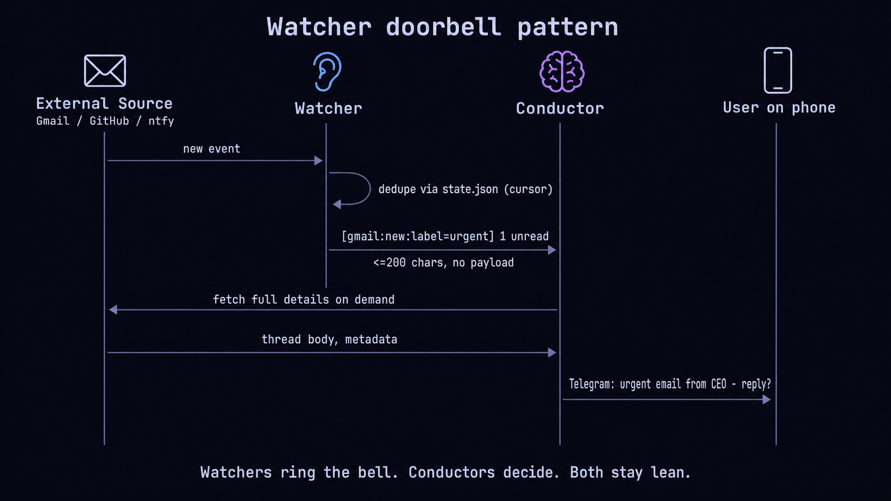

# Watcher setup — give your fleet ears

> **TL;DR** — A *watcher* is a lightweight process that listens to something
> external (GitHub webhook, ntfy push, gmail inbox, etc.) and rings the
> doorbell on a conductor when something happens. The conductor decides what
> to do. The watcher never thinks.

This is the **onboarding** guide. For the deeper reference (adapter internals,
HMAC verification, custom adapters), see
[`documentation/WATCHERS.md`](../documentation/WATCHERS.md).

If you don't have a conductor yet, read
[`CONDUCTOR-SETUP.md`](CONDUCTOR-SETUP.md) first. A watcher with no
conductor to ring is just a process spinning silently.



---

## Why bother with watchers?

You already have a conductor running. From your phone you can ask it
questions and it can summarise the fleet. Great. But what if you want
the *outside world* to be able to wake up the conductor?

Examples that show up in practice:

- A PR opens on a repo you care about → conductor pings you on Telegram
  with "review or skip?".
- A new email lands in a label you've curated → conductor checks the
  thread, replies if it's routine, escalates if it's not.
- A 30-minute calendar event starts in 5 min → conductor pre-loads the
  attendees and the doc, hands you the briefing.
- A long deploy finishes → conductor verifies the smoke tests and tells
  you "green, ship-ready".

You don't want each of those to live inside the conductor's context (it
would never compact). And you don't want one giant process that knows
about every source.

The solution is the **doorbell pattern**: a small process per source that
*notices* events and *forwards a tiny trigger*. The conductor reads the
trigger, decides if it cares, and if so fetches the full payload on
demand. Watchers stay dumb. Conductors stay lean.

---

## The doorbell, drawn out

```
┌──────────────┐  new event  ┌──────────────┐  [src:type:id] hint  ┌─────────────┐
│ External     │ ─────────►  │  Watcher     │ ───────────────────► │ Conductor   │
│ source       │             │              │  (<=200 chars)       │             │
│  (GitHub,    │             │  dedupes     │                      │ decides if  │
│   Gmail,     │             │  via         │                      │ it cares,   │
│   ntfy …)    │             │  state.json  │                      │ fetches     │
└──────────────┘             └──────────────┘                      │ live state, │
                                                                   │ acts        │
                                                                   └──────┬──────┘
                                                                          │
                                                                          ▼
                                                              ┌────────────────────┐
                                                              │ User on phone via  │
                                                              │ Telegram / Slack   │
                                                              └────────────────────┘
```

Two rules govern the pattern:

1. **The trigger is ≤200 chars** and carries no payload — just a stable
   identifier the conductor can use to fetch live state.
2. **The watcher dedupes locally** so the same event never fires twice on
   the conductor, even if the source re-delivers (GitHub retries,
   IMAP reconnect, cron overlap).

That is the whole pattern. Everything else is which adapter you pick and
which conductor you point it at.

---

## Two flavours of watcher

agent-deck supports two kinds of watcher depending on how the source
delivers events:

| Flavour | When to use it | Where it runs |
|---|---|---|
| **First-class adapter** (HTTP / push) | Source can webhook to you, or you can subscribe to a push stream | Inside agent-deck's engine; managed by `agent-deck watcher` |
| **External polling script** | Source needs polling (IMAP, calendar API, status page) | Anywhere — small script, calls `agent-deck session send` |

Both produce the same kind of trigger. The conductor cannot tell them
apart. Pick whichever the source forces on you.

---

## First-class adapters (5 min)

Four adapter types ship in the box:

| Type | Source | Required flag |
|---|---|---|
| `webhook` | Any service that can POST to a local HTTP listener | `--port <int>` |
| `github` | GitHub repository / org webhooks (HMAC-verified) | `--secret <hmac-secret>` |
| `ntfy` | [ntfy.sh](https://ntfy.sh) push notifications (phone → conductor) | `--topic <name>` |
| `slack` | Slack messages via a Cloudflare Worker bridge → ntfy | `--topic <name>` |

### Example: a GitHub watcher in three commands

```bash
# 1. Create the watcher (writes ~/.agent-deck/watcher/gh-alerts/).
agent-deck watcher create github --name gh-alerts \
  --secret "$GITHUB_WEBHOOK_SECRET"

# 2. Activate it (the engine picks it up on the next tick).
agent-deck watcher start gh-alerts

# 3. Smoke-test routing without waiting for a real event.
agent-deck watcher test gh-alerts
```

Then on the GitHub side: settings → webhooks → add webhook, point at
your watcher's URL (the `--port` for `webhook`, or whatever your reverse
proxy fronts), content type `application/json`, secret = the same value
you passed `--secret`. Save. Send a test delivery from the GitHub UI.

You should see the event in:

```bash
agent-deck watcher status gh-alerts        # recent events + health
agent-deck watcher list                    # all watchers + events/hour
```

And — assuming routing is wired (next section) — your conductor should
receive a message like:

```
[github:pr_opened:asheshgoplani/agent-deck#1234]
```

### The other three adapter types

```bash
# Generic HTTP webhook on port 9000 (any service that can POST JSON).
agent-deck watcher create webhook --name my-webhook --port 9000

# ntfy.sh push notifications — easiest way to pipe phone events into the fleet.
agent-deck watcher create ntfy --name phone-alerts --topic <random-long-string>

# Slack-bridged via ntfy (see watcher-creator skill for the Cloudflare Worker).
agent-deck watcher create slack --name team-slack --topic <random-long-string>
```

> **Conversational shortcut.** If picking flags feels heavy, install the
> assistant skill once: `agent-deck watcher install-skill watcher-creator`.
> Then inside any agent-deck Claude session: *"Use the watcher-creator
> skill to set up a GitHub watcher on this repo."* The skill asks the
> right questions and emits the exact CLI for you.

---

## Routing: telling the watcher which conductor to ring

Every watcher writes its routing rules to
`~/.agent-deck/watcher/<name>/clients.json`:

```json
{
  "github:pr_opened:asheshgoplani/agent-deck": "work",
  "github:issues:asheshgoplani/agent-deck": "work",
  "github:push:*": "infra"
}
```

The key is a glob over `<source>:<type>:<identifier>`. The value is the
conductor name (matches what you passed to
`agent-deck conductor setup <name>`).

Two ways to set this up:

1. **Edit `clients.json` by hand.** Easiest if you know exactly what you
   want.
2. **Run `agent-deck watcher routes`** to see what's currently wired
   across every watcher — useful when you forget which watcher is ringing
   which conductor.

```bash
agent-deck watcher routes              # human-readable
agent-deck watcher routes --json       # machine-readable
```

One watcher can ring multiple conductors (different routing rules), and
one conductor can receive events from many watchers. There is no hard
limit. Each rule is independent.

---

## External polling watchers

For sources that don't push (IMAP inboxes, calendar APIs, third-party
SaaS dashboards), the cleanest pattern is a **small external script**
that polls and forwards triggers via `agent-deck session send`.

### The pattern in one minimal example

```bash
#!/usr/bin/env bash
# gmail-watcher.sh — polls IMAP for unread, dedupes, rings the conductor.
set -euo pipefail

CONDUCTOR="personal"
STATE="$HOME/.agent-deck/events/gmail-watcher.last"
mkdir -p "$(dirname "$STATE")"

LAST_SEEN_UID=$(cat "$STATE" 2>/dev/null || echo 0)
NEW_UIDS=$(your-imap-cli --label "agent-deck" --since-uid "$LAST_SEEN_UID")

for uid in $NEW_UIDS; do
  # Lean trigger — no payload, just an identifier the conductor can fetch later.
  agent-deck session send "conductor-$CONDUCTOR" \
    "[gmail:new:label=agent-deck:uid=$uid]" \
    --no-wait
  echo "$uid" > "$STATE"
done
```

Run it under `cron`, `systemd-timer`, `launchd`, or even an agent-deck
session of its own (`agent-deck add` + a custom `command`). Whatever.

Four things matter, in order:

1. **Dedupe locally.** A state file (`.last`, a SQLite cursor, whatever)
   prevents the same event firing twice when the source re-delivers.
2. **Forward lean.** ≤200 chars, no payload, just an identifier. The
   conductor will fetch the body if it cares.
3. **Use `--no-wait`.** `session send` blocks until the session ACKs by
   default. A wedged conductor will then wedge every poller that forwards
   to it. `--no-wait` makes the script fire-and-forget.
4. **Page yourself on silence.** A watcher that cannot reach its
   conductor is worse than useless — nobody notices. Log every successful
   send, alert if the send count drops to zero for an hour.

### Two reference watchers (informal, maintainer-side)

These do not ship in the repo because they're tied to one user's
credentials. They are the canonical examples of the polling pattern:

- **`gmail-watcher`** — polls an IMAP label, fires
  `[gmail:new:label=<label>:uid=<n>]` triggers. The conductor uses the
  Gmail MCP to fetch the thread, classifies it via `POLICY.md`, and
  either auto-replies or escalates.
- **`meeting-watcher`** — polls Google Calendar every 5 min, fires
  `[calendar:starting:<event-id>]` ~5 minutes before meetings. The
  conductor pre-loads the docs / attendees / Slack channel for the
  meeting and hands you the briefing on Telegram.

The full identities live in `~/.agent-deck/watcher/gmail-watcher/` and
`~/.agent-deck/watcher/meeting-watcher/` on the maintainer's machine —
copy the layout (`meta.json`, `state.json`, `task-log.md`,
`LEARNINGS.md`), substitute your own credentials, point at your own
conductor.

---

## Trigger format conventions

A trigger is `[<source>:<type>:<identifier>] <optional short hint>`.
≤200 chars, period.

| Source     | Type                  | Identifier examples                          |
|------------|-----------------------|----------------------------------------------|
| `github`   | `pr_opened`, `pr_review_requested`, `issue_opened`, `push` | `<owner>/<repo>#<num>`, `<owner>/<repo>@<sha7>` |
| `gmail`    | `new`, `reply`        | `label=<label>:uid=<n>`, `thread=<id>`        |
| `calendar` | `starting`, `ended`   | `<event-id>`                                  |
| `ntfy`     | `message`             | `<topic>`                                     |
| `slack`    | `mention`, `dm`       | `<channel>:<ts>`                              |
| `deploy`   | `succeeded`, `failed` | `<service>:<sha7>`                            |

Stable identifiers matter — `clients.json` globs over them, the
conductor logs them, and `events.log` dedupes on them. Don't put
timestamps or one-shot UUIDs in the identifier slot; that defeats
dedupe.

---

## Common gotchas

### 1. "My trigger is 400 characters of email body"

Don't. Every kilobyte of trigger costs context on every conductor turn
until compaction. Pass an identifier; the conductor fetches the body if
it cares. This is the single most important rule.

### 2. "Polling script is re-firing the same event"

You forgot to dedupe locally. The state file is non-optional. SQLite
under `~/.agent-deck/events/` works; so does a plain `.last` file.

### 3. "Polling script silently blocks when the conductor is down"

You forgot `--no-wait`. `agent-deck session send` waits for an ACK by
default; if the conductor is wedged, every poller forwarding to it
wedges too. Cascading failure. Always use `--no-wait` in a polling loop.

### 4. "ntfy topic leaked into a public config"

ntfy has no auth beyond topic-secrecy. Keep topic names in
`~/.agent-deck/watcher/<name>/watcher.toml` or env vars — never in
tracked files.

### 5. "GitHub watcher silently drops events"

The HMAC check is non-negotiable. If your `--secret` doesn't match what
GitHub is signing with, every event is dropped (with the error counter
incremented). Check `agent-deck watcher status <name>` — the
`error_count` will give it away.

### 6. "Watcher status shows healthy but conductor never gets pinged"

Routing is misconfigured. Run `agent-deck watcher test <name>` — it
fires a synthetic event through the same pipeline. If that works and
real events don't, your `clients.json` glob doesn't match the event
identifier. If `test` fails too, the conductor isn't running or the
session name is wrong.

---

## Cheatsheet

```bash
# Create + activate (4 adapter types)
agent-deck watcher create webhook --name my-webhook --port 9000
agent-deck watcher create github  --name gh-alerts  --secret "$SECRET"
agent-deck watcher create ntfy    --name phone-alerts --topic <random>
agent-deck watcher create slack   --name team-slack   --topic <random>
agent-deck watcher start <name>

# Inspect
agent-deck watcher list                  # all watchers + health + events/hour
agent-deck watcher status <name>         # one watcher, detailed
agent-deck watcher routes                # what's routing to which conductor
agent-deck watcher test <name>           # synthetic event end-to-end

# Conversational setup
agent-deck watcher install-skill watcher-creator

# Polling-script forward
agent-deck session send conductor-<name> "[src:type:id] hint" --no-wait

# Stop / teardown
agent-deck watcher stop <name>
```

For adapter internals, HMAC details, custom adapters, the build test
matrix, see [`documentation/WATCHERS.md`](../documentation/WATCHERS.md).

For what happens *after* the bell rings, see
[`CONDUCTOR-SETUP.md`](CONDUCTOR-SETUP.md) and
[`documentation/CONDUCTOR.md`](../documentation/CONDUCTOR.md).
